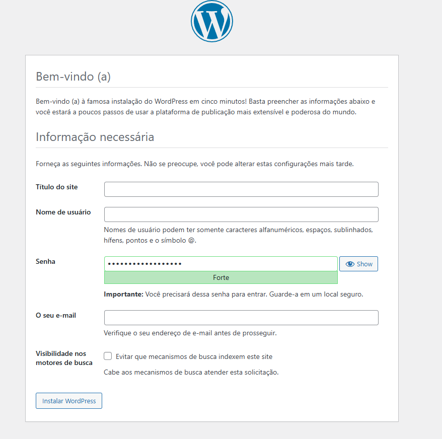
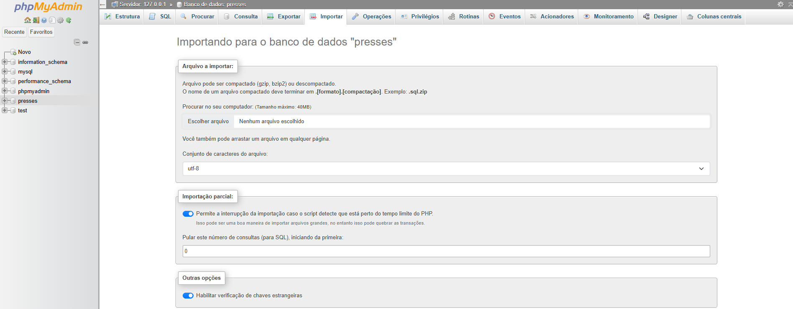

# Instalação e primeiros acessos ao WordPress (local)

Este README descreve, passo a passo, como instalar o WordPress em uma máquina local usando XAMPP e como realizar os primeiros acessos, incluindo opções para acesso pela rede local, backup e habilitação de Multisite.

## Requisitos

- XAMPP (Apache + MySQL + PHP)
- Arquivo do WordPress (baixado de https://wordpress.org/download/)
- Navegador (Chrome, Firefox, etc.)

## 1. Instalar o XAMPP

1. Baixe e instale o XAMPP: https://www.apachefriends.org/pt_br/index.html
2. Abra o Painel de Controle do XAMPP e inicie os módulos Apache e MySQL.

## 2. Preparar os arquivos do WordPress

1. Extraia o arquivo .zip do WordPress baixado.
2. Copie a pasta `wordpress` para o diretório `htdocs` do XAMPP (por exemplo `C:/xampp/htdocs/wordpress` ou `/opt/lampp/htdocs/wordpress`).

## 3. Criar o banco de dados

1. Acesse o phpMyAdmin em: `http://localhost/phpmyadmin`
2. Clique em **Novo** e crie um banco de dados com o nome `wordpress` (Collation: `utf8mb4_general_ci`).
3. Vá em **Privilégios** e adicione um usuário com host `localhost`, concedendo todos os privilégios ao banco `wordpress`.

## 4. Configurar `wp-config.php`

1. Na pasta `C:/xampp/htdocs/wordpress` (ou equivalente), localize `wp-config-sample.php`.
2. Renomeie para `wp-config.php` e edite as definições do banco de dados:

```php
define( 'DB_NAME', 'wordpress' );
define( 'DB_USER', 'seu_usuario' );
define( 'DB_PASSWORD', 'sua_senha' );
define( 'DB_HOST', 'localhost' );
define( 'DB_CHARSET', 'utf8mb4' );
$table_prefix = 'wp_';
```

3. Salve o arquivo.

## 5. Executar a instalação via navegador

1. Acesse: `http://localhost/wordpress`.
2. Escolha o idioma, preencha os dados do site (título, usuário administrador, senha, e-mail) e clique em **Instalar WordPress**.
3. Após a instalação, faça login em: `http://localhost/wordpress/wp-admin/`.



## 6. Acesso pela rede local (outros dispositivos)

Para permitir acesso ao WordPress a partir de outros dispositivos na mesma rede local:

1. Descubra o IP do seu computador na rede (ex.: `192.168.1.100`).
2. No `wp-config.php` (em `C:/xampp/htdocs/wordpress`) adicione acima de `/* That's all, stop editing! Happy publishing. */`:

```php
define('WP_HOME','http://192.168.1.100/wordpress');
define('WP_SITEURL','http://192.168.1.100/wordpress');
```

3. Configure o VirtualHost do Apache: abra `C:/xampp/apache/conf/extra/httpd-vhosts.conf` e adicione ao final:

```apache
<VirtualHost *:80>
    DocumentRoot "C:/xampp/htdocs"
    ServerName 192.168.1.100
    <Directory "C:/xampp/htdocs">
        Options Indexes FollowSymLinks
        AllowOverride All
        Require all granted
    </Directory>
</VirtualHost>
```

4. Reinicie o Apache pelo Painel do XAMPP.
5. Acesse `http://192.168.1.100/wordpress` a partir de outro dispositivo na rede.

## 7. Backup rápido (essencial)

Backup completo manual:

- Exportar o banco de dados via phpMyAdmin (aba Exportar) — gera um arquivo `.sql`.
- Copiar toda a pasta `C:/xampp/htdocs/wordpress` para outro local.

Backup parcial (essenciais):

- Exportar banco de dados.
- Copiar `wp-content/plugins/`, `wp-content/themes/`, `wp-content/uploads/`, `wp-config.php`, e `.htaccess` (se houver).

Restaurando:

- Substitua os arquivos no diretório WordPress pelos do backup parcial.
- Importe o `.sql` no phpMyAdmin (aba Importar) para restaurar o banco.



## 8. Habilitar Multisite (opcional)

1. Faça backup antes de qualquer alteração.
2. No `wp-config.php` adicione acima de `/* That's all, stop editing! Happy publishing. */`:

```php
define( 'WP_ALLOW_MULTISITE', true );
```

3. No painel do WordPress vá em **Ferramentas > Instalação da Rede** e siga as instruções.
4. Após a instalação, cole as diretivas fornecidas no `wp-config.php` e substitua o conteúdo do `.htaccess` pelas regras indicadas.

Exemplo de diretivas (fornecido pela instalação de rede):

```php
define( 'MULTISITE', true );
define( 'SUBDOMAIN_INSTALL', false );
define( 'DOMAIN_CURRENT_SITE', 'localhost' );
define( 'PATH_CURRENT_SITE', '/wordpress/' );
define( 'SITE_ID_CURRENT_SITE', 1 );
define( 'BLOG_ID_CURRENT_SITE', 1 );
```

Regras de `.htaccess` recomendadas para multisite com subdiretórios:

```apache
RewriteEngine On
RewriteRule .* - [E=HTTP_AUTHORIZATION:%{HTTP:Authorization}]
RewriteBase /wordpress/
RewriteRule ^index\.php$ - [L]

# add a trailing slash to /wp-admin
RewriteRule ^([_0-9a-zA-Z-]+/)?wp-admin$ $1wp-admin/ [R=301,L]

RewriteCond %{REQUEST_FILENAME} -f [OR]
RewriteCond %{REQUEST_FILENAME} -d
RewriteRule ^ - [L]
RewriteRule ^([_0-9a-zA-Z-]+/)?(wp-(content|admin|includes).*) $2 [L]
RewriteRule ^([_0-9a-zA-Z-]+/)?(.*\.php)$ $2 [L]
RewriteRule . index.php [L]
```

## Links úteis

- Download WordPress: https://wordpress.org/download/
- XAMPP: https://www.apachefriends.org/pt_br/index.html

---

Se desejar, posso também:
- Criar uma versão curta para impressão.
- Adicionar instruções específicas para Linux ou macOS.
- Traduzir para inglês.
